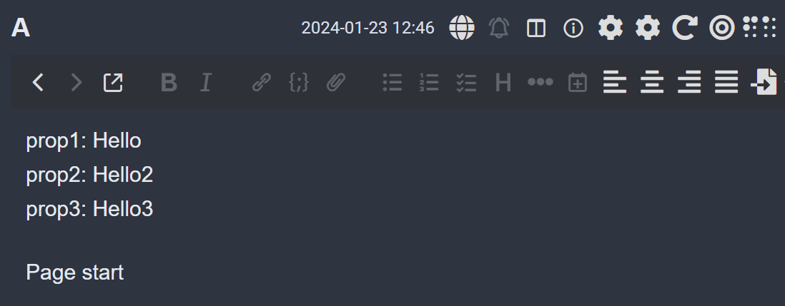
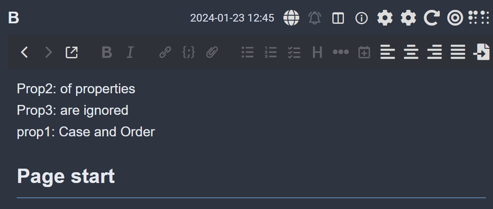
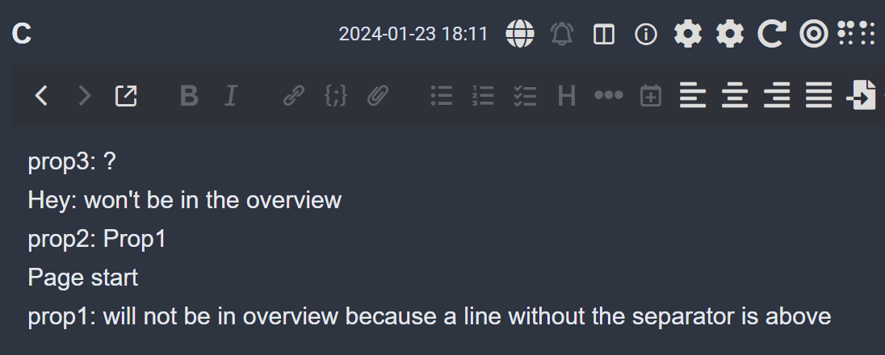
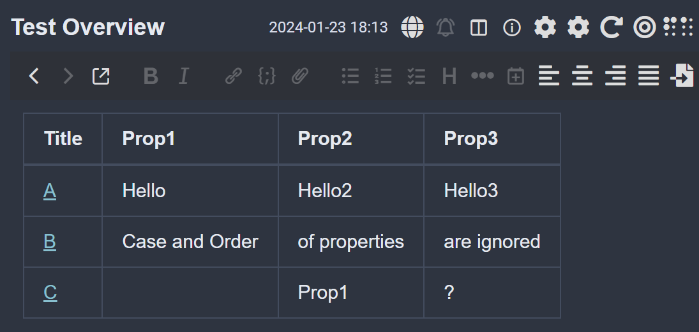

# Joplin Overview
Creates a note with an overview table for a notebook, similar to a Notion 
landing page with links to all the "subpages". 
You can define the properties which will each be a column in the final overview.
The properties need to be in a specific format for this script to work as is: 
- \<property_name> \<separator> \<value> (you can change the separator, after 
importing from Notion it should be a colon)
- the properties need to be at the top of the page without any empty lines or 
lines without the specified separator in between (e.g. "prop1" in Note C is not in the overview in the [example](#example))

Things that don't cause problems:
- properties are not in order
- properties are written in different cases throughout the notebook
(this also means that there cannot 
be two different properties that only differ in their capitalization)
- there are lines in between the properties that contain the separator 
but the property name isn't one of the ones specified to show up in the overview;
these will just be ignored
(e.g. "Hey" in Note C in the [example](#example))
- missing values for some or all of the properties in a note

# Example
Running the script on a notebook called "Test" which contains the following
three notes:

…will create this overview (with the specified 
properties being "Prop1", "Prop2" and "Prop3" like in the unchanged script):

# Usage
1. Fill in the section at the top
2. Run script